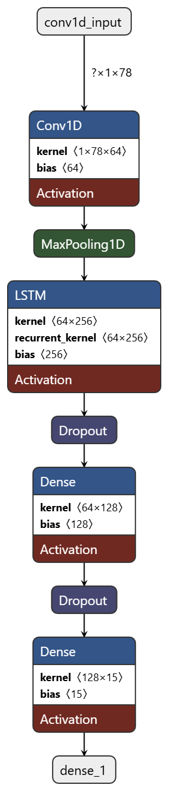

# CyberNeuron : Network Intrusion Detection using Deep Learning

This project presents a deep learning-based approach for detecting network intrusions. The model leverages a hybrid architecture of Convolutional Neural Networks (CNN) and Long Short-Term Memory (LSTM) to effectively classify network traffic from the CIC-IDS2017 dataset.

## Table of Contents
- [Dataset](#dataset)
- [Model Architecture](#model-architecture)
- [Feature Importance](#feature-importance)
- [Performance](#performance)
- [File Structure](#file-structure)
- [Installation](#installation)
- [Usage](#usage)

## Dataset
The model is trained and evaluated on the **CIC-IDS2017 dataset**. This dataset contains a wide variety of network traffic, including both benign and common attack scenarios.

You can download the dataset from Kaggle:
[**Network Intrusion Dataset**](https://www.kaggle.com/datasets/chethuhn/network-intrusion-dataset)

## Model Architecture
The neural network architecture is designed to capture both spatial and temporal features from the network traffic data. It consists of:
1.  A **1D Convolutional Layer** to extract local features.
2.  A **MaxPooling Layer** to downsample the feature maps.
3.  An **LSTM Layer** to model the sequential nature of the data.
4.  Two **Dense Layers** for the final classification task.



## Feature Importance
To understand the model's decision-making process, SHAP (SHapley Additive exPlanations) was employed. The plot below highlights the most influential features in detecting intrusions.


## Performance
The model demonstrates strong performance, achieving an accuracy of **above 90%** on the unseen test set.

## File Structure

<pre>
.
├── Dataset/
│   └── ... (CIC-IDS2017 CSV files)
├── Model/
│   └── best_model.keras
├── app.py
├── intrusion_detection.py
├── requirements.txt
└── README.md
</pre>

## Installation
To set up the project environment, you can install the necessary dependencies using pip.

1.  Clone the repository:
    ```bash
    git clone https://github.com/Dipurajasaha/CyberNeuron.git
    cd CyberNeuron
    ```
2.  Install the required packages from `requirements.txt`:
    ```bash
    pip install -r requirements.txt
    ```
    Alternatively, you can install them manually:
    ```bash
    pip install pandas numpy scikit-learn tensorflow shap matplotlib
    ```

## Usage
Follow these steps to run the model training and evaluation.

1.  **Download the Dataset**: Make sure you have downloaded the CIC-IDS2017 dataset from the link above and placed all the `.csv` files inside the `Dataset/` directory.

2.  **Run the Training Script**: Execute the main Python script to start the training process. The script will handle data preprocessing, model training, and will save the best performing model in the `Model/` directory.
    ```bash
    python intrusion_detection.py
    ```
3.  **Run the Application (Future)**: Once `app.py` is implemented, you will be able to run the application for real-time or batch predictions.
    ```bash
    python app.py
    ```
